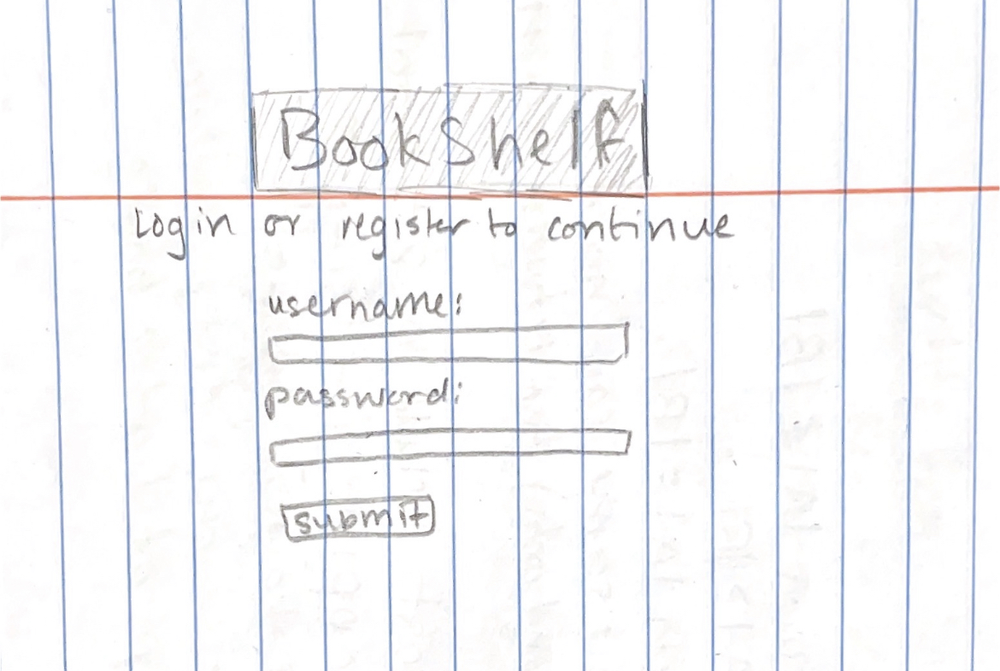
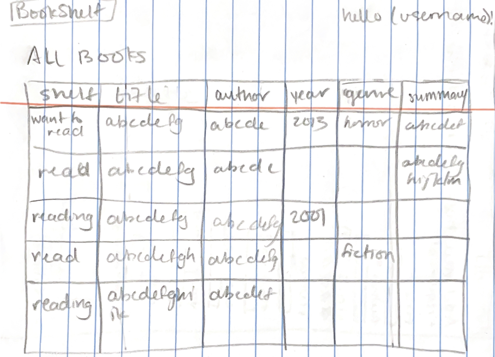
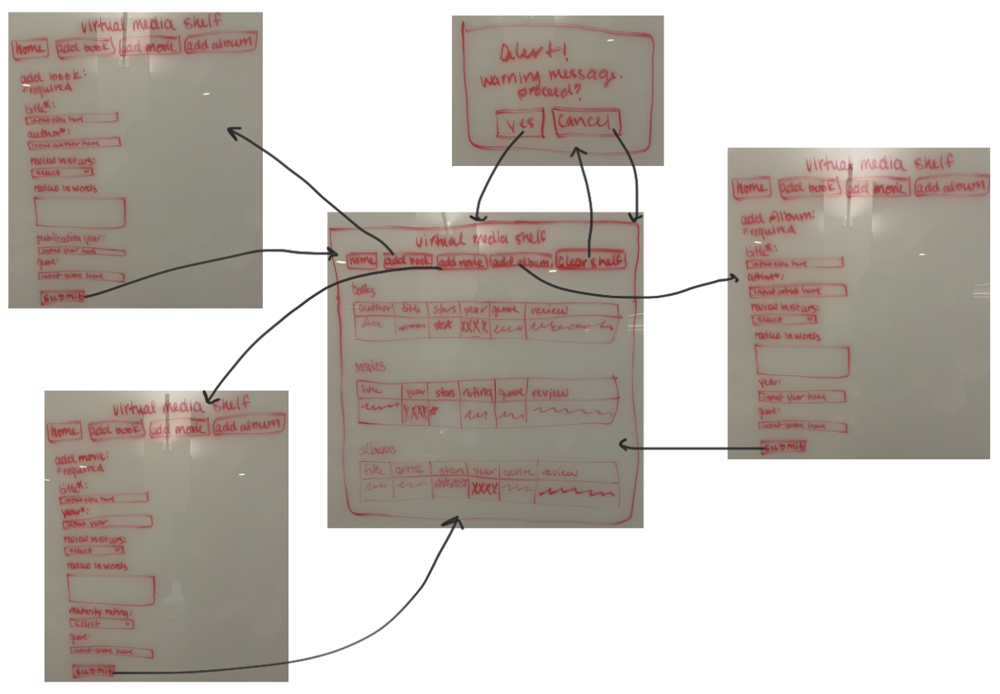

# BookShelf

## Overview

A virtual media stand. Users can store lists of books, movies, and albums they enjoy. Users can see the entire media stand on the home page, or see individual lists of books, movies, or albums.

## Data Model

The application will store Books, Movies, and Albums.

* each Book will have an author and title, with  optional elements: reviews (word- or star-based), publication year, and genre
* each Movie with have a title and year, with optional elements: reviews (word- or star-based), maturity rating, and genre
* each Album will have a title and artist, with optional elements: review (word- or star-based), release year, and genre

An Example Book:

```javascript
{
  author: "Colleen Hoover" //string
  title: "Fated" //string
  
  //optional elements
  review: "this book sucks" //string
  stars: 1 //numbered rating 1-5
  year: 2021 //year published
  genre: "Romance" //string
}
```

An Example Movie:

```javascript
{
  title: "Oppenheimer" //string
  year: 2023 //number
  
  //optional elements
  review: "so long" //string
  stars: 3 //numbered rating 1-5
  genre: "Drama" //string
  rating: "R" //string
}
```

An Example Album:

```javascript
{
  title: "1989 (Taylor's Version)" //string
  artist: "Taylor Swift" //string
  
  //optional elements
  review: "amazing love groundbreaking life-changing never-before-seen" //string
  stars: 5 //numbered rating 1-5
  year: 2023 //year published
  genre: "Pop" //string
}
```


## [Link to Commented First Draft Schema](db.mjs) 

# __WILL DO: UPDATE WIREFRAMES__
## Wireframes

/home - homepage
<!---->

/addBook - add a book to the shelf
<!---->

/addMovie - add a movie to the shelf
<!---->

/addAlbum - add an album to the shelf
<!---->

/books - see all books
<!---->

/movies - see all movies
<!---->

/albums - see all albums
<!---->

# __WILL DO: UPDATE SITE MAP__
## Site map
<!---->

## User Stories
as a user, I can...
* see all my media elements and their information on my home page
* see all my books on one page
* see all my movies on one page
* see all my albums on one page
* add a new book to my shelf
* add a new movie to my shelf
* add a new album to my shelf

# TODO: UPDATE RESEARCH TOPICS
## Research Topics

* (3 points) Perform client side form validation using custom JavaScript or JavaScript library
    * will validate user input before the form is submitted
    * will only allow valid inputs to be submitted and tell users how to format their input
    * use: parsley library
* (2 points) Use a CSS framework or UI toolkit, with reasonable customization of the framework:
  * will improve the appearance of the website
  * will make it easier to style the website for a more modern look
  * probably semantic UI: tailwind.css, Semantic UI, Bootstrap
* (2 points) SweetAlert - promise based js library for pop-ups
  * used to alert the user about invalid inputs
* (2 point) anime.js - js animation library
  * used for animated background (fire + fireplace)
* (1 point) feather icon collection - for icons
  * used for books, music, movie icons
  * among other icons

10 points total out of 10 required points


## [Link to Initial Main Project File](app.mjs) 

## Annotations / References Used

1. [parsley site](https://parsleyjs.org/)
2. [semantic UI site](https://semantic-ui.com/)
3. [semantic UI default theme example](https://semantic-ui-forest.com/themes/semantic-ui/v2/material)
4. [SweetAlert site](https://sweetalert2.github.io/)
5. [anime.js github](https://github.com/juliangarnier/anime/#getting-started)
6. [anime.js fireplace](https://codepen.io/cweachock/pen/rNxjRbd)
7. [feather site](https://feathericons.com/?ref=hackernoon.com)
8. [feather github](https://github.com/feathericons/feather#feather)

. [animate.css (1pt, just-add-water css)](https://animate.style/)