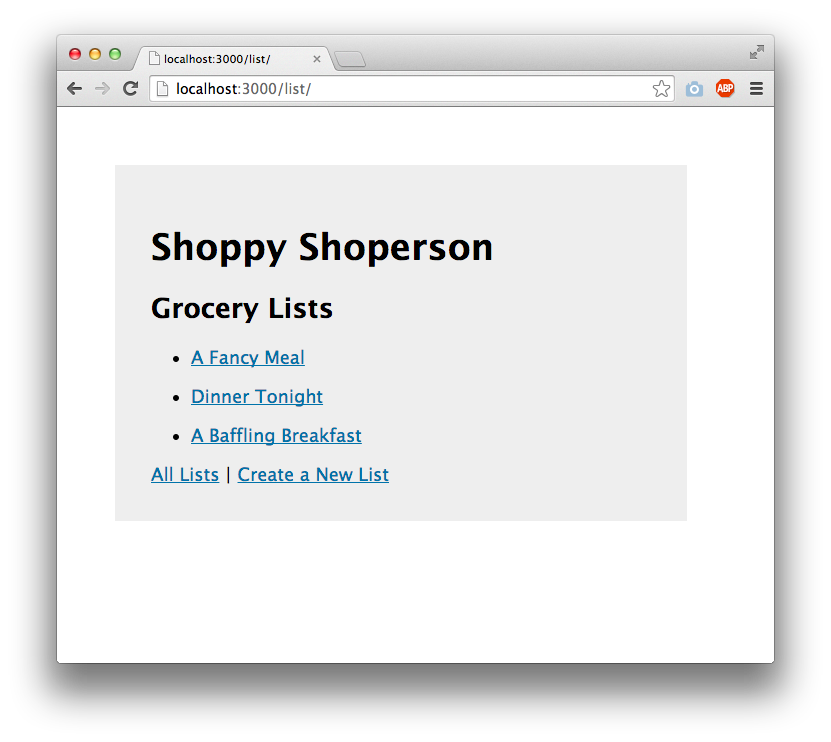

The content below is an example project proposal / requirements document. Replace the text below the lines marked "__TODO__" with details specific to your project. Remove the "TODO" lines.

# BookShelf

## Overview

A virtual bookshelf. Users can register and login to access, store and update lists of books they want to read, are currently reading, and have finished reading. Each book entry includes the author, title, and user progress. Users can also add a publication year, genre, summary, start/finish dates, and reviews of books they have marked as read. 

## Data Model

The application will store Users and Books

* users will have three bookshelves (arrays of Books)
  * these bookshelves will sort a User's Books into 'want to read', 'currently reading', and 'read' categories
* each Book will have an author, title, shelf, and progress %, with an optional start/end date, review, star review, year, genre, and summary
  * Users can only change the progress % for books they are currently reading, while 'want to read' will be set at 0% and 'read' will be set at 100%
  * Users can only change the review for books they are currently reading or have read, otherwise the review will be blank

An Example User:

```javascript
{
  username: "myUser",
  hash: "hfdFDjk4%(4FGy8#21bgS%" // a password hash,
  bookshelves: [wantToRead, reading, read] // an array of 3 sub-arrays
  // each sub-array stores Book objects
}
```

An Example Book:

```javascript
{
  user: "myUser" // a reference to a User object
  shelf: "wantToRead",
  author: "Colleen Hoover" //string
  title: "Fated" //string
  progress: 0 //number, 0 as we want to read it
  
  //optional elements
  review: "this book sucks" //string
  stars: 0 //numbered rating 0-5
  startDate: 05/12/2023 //date
  endDate: 07/19/2023 //date
  year: 2021 //year published
  genre: "Romance" //string
  summary: "idk they fall in love" //string
}
```


## [Link to Commented First Draft Schema](db.mjs) 

## Wireframes

(__TODO__: wireframes for all of the pages on your site; they can be as simple as photos of drawings or you can use a tool like Balsamiq, Omnigraffle, etc.)

/list/create - page for creating a new shopping list


/list - page for showing all shopping lists



/list/slug - page for showing specific shopping list


## Site map

(__TODO__: draw out a site map that shows how pages are related to each other)

Here's a [complex example from wikipedia](https://upload.wikimedia.org/wikipedia/commons/2/20/Sitemap_google.jpg), but you can create one without the screenshots, drop shadows, etc. ... just names of pages and where they flow to.

## User Stories or Use Cases

(__TODO__: write out how your application will be used through [user stories](http://en.wikipedia.org/wiki/User_story#Format) and / or [use cases](https://en.wikipedia.org/wiki/Use_case))

1. as non-registered user, I can register a new account with the site
2. as a user, I can log in to the site
3. as a user, I can create a new grocery list
4. as a user, I can view all of the grocery lists I've created in a single list
5. as a user, I can add items to an existing grocery list
6. as a user, I can cross off items in an existing grocery list

## Research Topics

(__TODO__: the research topics that you're planning on working on along with their point values... and the total points of research topics listed)

* (5 points) Integrate user authentication
    * I'm going to be using passport for user authentication
    * And account has been made for testing; I'll email you the password
    * see <code>cs.nyu.edu/~jversoza/ait-final/register</code> for register page
    * see <code>cs.nyu.edu/~jversoza/ait-final/login</code> for login page
* (4 points) Perform client side form validation using a JavaScript library
    * see <code>cs.nyu.edu/~jversoza/ait-final/my-form</code>
    * if you put in a number that's greater than 5, an error message will appear in the dom
* (5 points) vue.js
    * used vue.js as the frontend framework; it's a challenging library to learn, so I've assigned it 5 points

10 points total out of 8 required points (___TODO__: addtional points will __not__ count for extra credit)


## [Link to Initial Main Project File](app.mjs) 

(__TODO__: create a skeleton Express application with a package.json, app.mjs, views folder, etc. ... and link to your initial app.mjs)

## Annotations / References Used

(__TODO__: list any tutorials/references/etc. that you've based your code off of)

1. [passport.js authentication docs](http://passportjs.org/docs) - (add link to source code that was based on this)
2. [tutorial on vue.js](https://vuejs.org/v2/guide/) - (add link to source code that was based on this)

