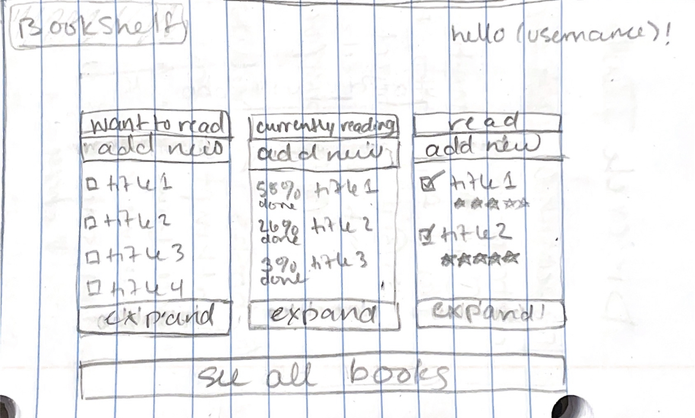
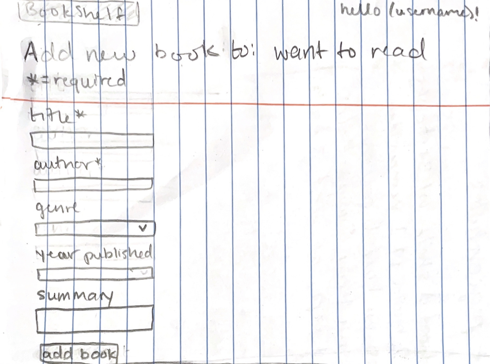
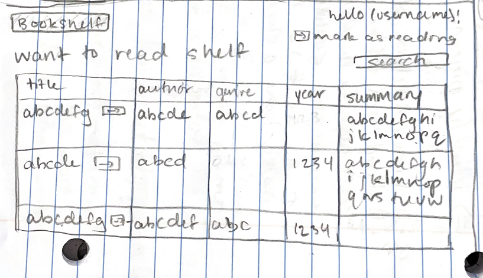
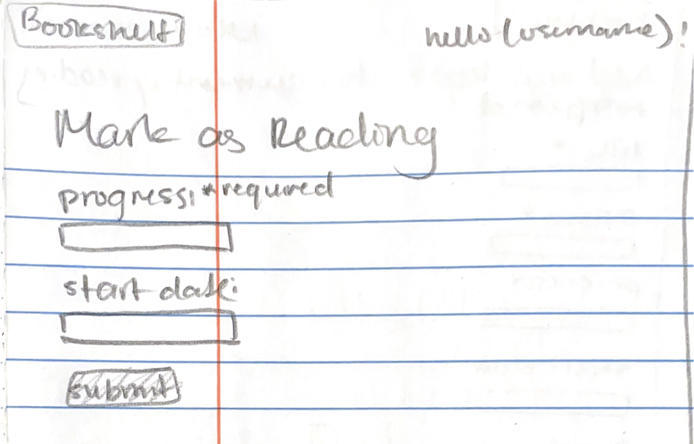
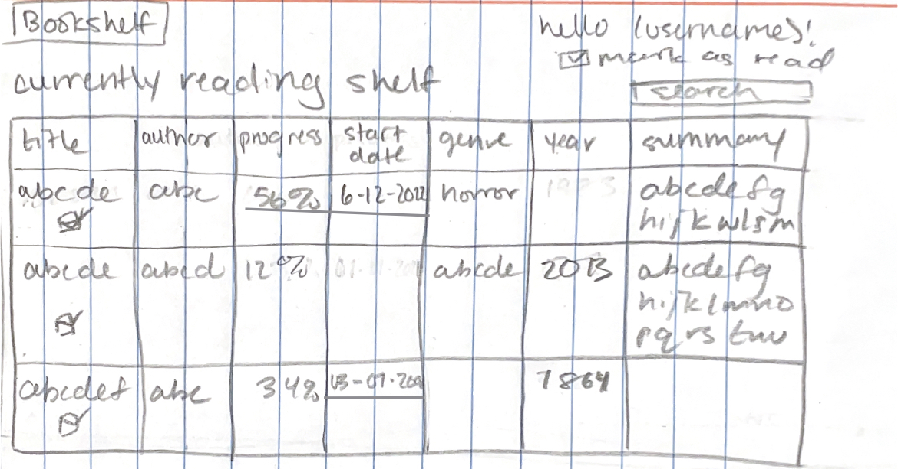
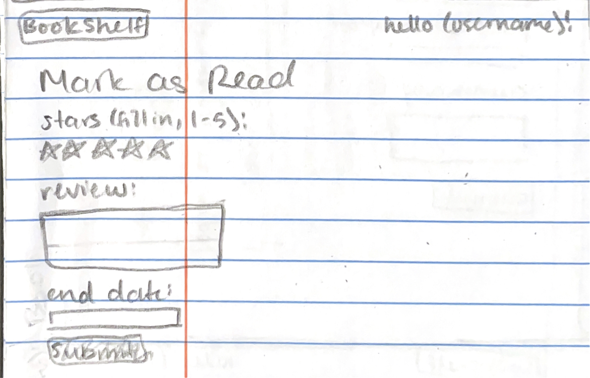
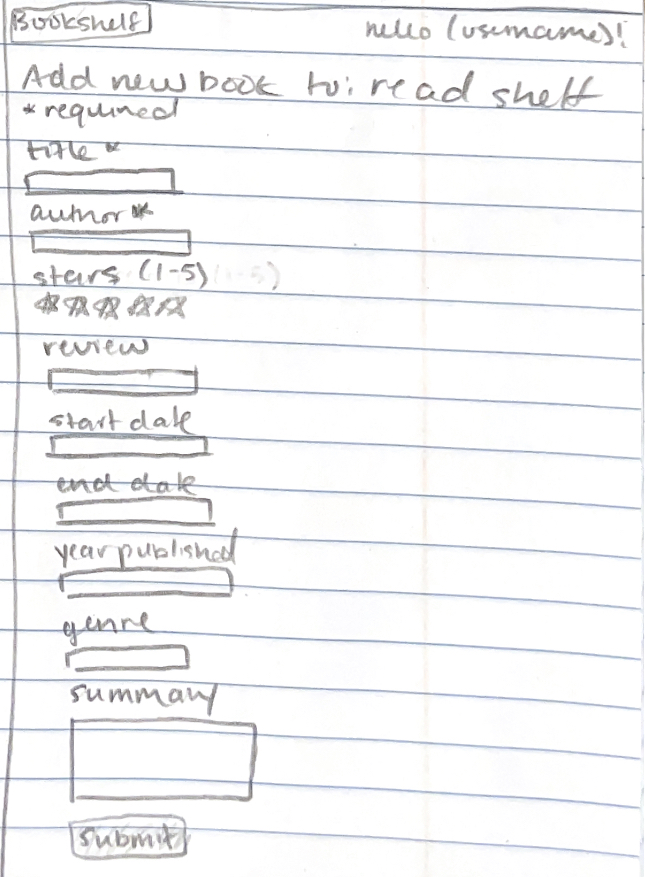
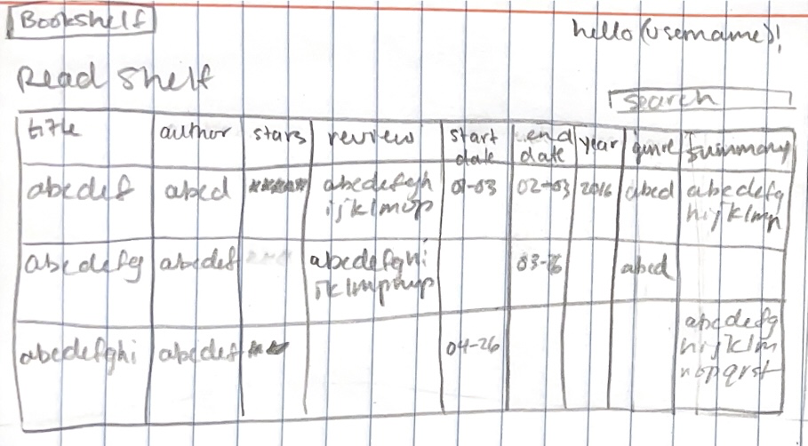

# BookShelf

## Overview

A virtual bookshelf. Users can register and login to access, store and update lists of books they want to read, are currently reading, and have finished reading. Each book entry includes the author, title, and user progress. Users can also add a publication year, genre, summary, start/finish dates, and reviews of books they have marked as read. 

## Data Model

The application will store Users and Books

* users will have three bookshelves (arrays of Books)
  * these bookshelves will sort a User's Books into 'want to read', 'currently reading', and 'read' categories
* each Book will have an author, title, shelf, and progress %, with an optional start/end date, review, star review, year, genre, and summary
  * Users can only change the progress % for books they are currently reading, while 'want to read' will be set at 0% and 'read' will be set at 100%
  * Users can only create a word/star review for books they have read
An Example User:

```javascript
{
  username: "myUser",
  hash: "hfdFDjk4%(4FGy8#21bgS%" // a password hash,
  bookshelves: [wantToRead, reading, read] // an array of 3 sub-arrays
  // each sub-array stores Book objects
}
```

An Example Book:

```javascript
{
  user: "myUser" // a reference to a User object
  shelf: "wantToRead",
  author: "Colleen Hoover" //string
  title: "Fated" //string
  progress: 0 //number, 0 as we want to read it
  
  //optional elements
  review: "this book sucks" //string
  stars: 1 //numbered rating 1-5
  startDate: 05/12/2023 //date
  endDate: 07/19/2023 //date
  year: 2021 //year published
  genre: "Romance" //string
  summary: "idk they fall in love" //string
}
```


## [Link to Commented First Draft Schema](db.mjs) 

## Wireframes

/home - homepage before logging in


/home - homepage after logging in


/all - all books


/wtr/add - adding to the 'want to read' shelf


/wtr/all - viewing the entire 'want to read' shelf


/wtr/move - moving a book from 'want to read' to 'currently reading'


/reading/add - adding to the 'currently reading' shelf


/reading/all - viewing the entire 'currently reading' shelf


/reading/move - moving a book from 'currently reading' to 'read'


/read/add - adding to the 'read' shelf


/read/all - viewing the entire 'read' shelf


## Site map


## User Stories or Use Cases

1. as non-registered user, I can register a new account with the site
2. as a user, I can log in to the site
3. as a user, I can add a new book to any of three virtual shelves: want to read, currently reading, and read
4. as a user, I can add the following information about any book: title, author, publication year, genre, and summary
5. as a user, I can track my progress, in %, to a book I am currently reading
6. as a user, I can add word and/or star reviews about any book I am reading or have read
7. as a user, I can add the dates I started and/or finished a book
8. as a user, I can view all of the books I've added to any single shelf in a single list
9. as a user, I can view all of the books I've added to any shelf in a single list
10. as a user, I can move books from the 'want to read' to the 'currently reading' shelf
11. as a user, I can move books from the 'currently reading' to the 'read' shelf
## Research Topics

(__TODO__: the research topics that you're planning on working on along with their point values... and the total points of research topics listed)

* (3 points) Perform client side form validation using custom JavaScript or JavaScript library
    * will validate user input before the form is submitted
    * will only allow valid inputs to be submitted and tell users how to format their input
    * I will use custom JavaScript/a JavaScript library to achieve this task
* (2 points) Use a CSS framework or UI toolkit, with reasonable customization of the framework:
  * will improve the appearance of the website
  * will make it easier to style the website for a more modern look
  * possible choices: tailwind.css, Semantic UI, Bootstrap
* (5 points) Automated functional testing for all of the routes
    * will automate the web app for testing
    * will be more robust than the testing I've done so far
    * possible choices: Selenium, Headless Chrome

10 points total out of 8 required points


## [Link to Initial Main Project File](app.mjs) 

## Annotations / References Used

1. [tailwind.css site](https://tailwindcss.com/)
2. [Bootstrap site](https://getbootstrap.com/)
3. [semantic UI site](https://semantic-ui.com/)
4. [Selinium site](https://www.selenium.dev/)
5. [Headless Chrome site](https://developer.chrome.com/blog/headless-karma-mocha-chai/)